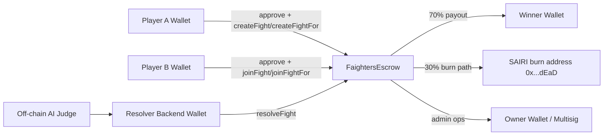

# FaightersEscrow

Production-focused Solidity escrow contract for two-player adversarial fights on `faighters.com`, built with Foundry and deployed to Base mainnet (`chainId = 8453`).

`FaightersEscrow` holds equal ERC-20 stakes from two players, then distributes outcome funds after an off-chain judge decision is finalized and submitted by a trusted resolver wallet.

## Table of Contents

- [Contract API Reference](#contract-api-reference)
- [1. PROJECT OVERVIEW](#1-project-overview)
- [2. ARCHITECTURE](#2-architecture)
- [3. TECHNOLOGY STACK](#3-technology-stack)
- [4. REPOSITORY STRUCTURE](#4-repository-structure)
- [5. PREREQUISITES](#5-prerequisites)
- [QUICKSTART FOR AI AGENTS](#quickstart-for-ai-agents)
- [6. INSTALLATION (STEP-BY-STEP)](#6-installation-step-by-step)
- [7. ENVIRONMENT CONFIGURATION](#7-environment-configuration)
- [8. RUNNING THE PROJECT LOCALLY](#8-running-the-project-locally)
- [9. TESTING](#9-testing)
- [10. BUILD PROCESS](#10-build-process)
- [11. DEPLOYMENT](#11-deployment)
- [12. AGENT-FRIENDLY INSTRUCTIONS](#12-agent-friendly-instructions)
- [13. TROUBLESHOOTING](#13-troubleshooting)
- [14. DEVELOPMENT WORKFLOW](#14-development-workflow)
- [15. SECURITY CONSIDERATIONS](#15-security-considerations)
- [16. FAQ](#16-faq)
- [17. FUTURE EXTENSIONS](#17-future-extensions)

---

## Contract API Reference

For a full, function-by-function contract deep dive (state, access rules, events, errors, lifecycle transitions, and resolver/owner operations), see:

- [`docs/CONTRACT_REFERENCE.md`](/Users/santisiri/AI/faighters/docs/CONTRACT_REFERENCE.md)

## 1. PROJECT OVERVIEW

### What this project does

`FaightersEscrow` is an on-chain escrow for 1v1 challenge matches:

1. Player A creates a fight and stakes token funds.
2. Player B joins and stakes the same amount in the same token.
3. A trusted backend resolver wallet submits the winner after off-chain judging.
4. Contract pays the winner and burns the house cut in SAIRI.

### Core architecture and purpose

The contract is designed for deterministic, auditable settlement with explicit operational roles:

- **Players**: fund challenges.
- **Resolver**: trusted backend signer for operational settlement.
- **Owner**: admin safety controls (`pause`, `setResolver`, surplus-only `emergencyWithdraw`).

### Key features and capabilities

- Supports fixed Base tokens:
  - WETH: `0x4200000000000000000000000000000000000006`
  - USDC: `0x833589fCD6eDb6E08f4c7C32D4f71b54bdA02913`
  - USDT: `0xfde4C96c8593536E31F229EA8f37b2ADa2699bb2`
  - SAIRI: `0xde61878b0b21ce395266c44D4d548D1C72A3eB07`
- Uses OpenZeppelin 5.x primitives:
  - `Ownable`, `Pausable`, `ReentrancyGuard`, `SafeERC20`
- Optional per-fight join and resolve deadlines.
- Configurable operational fee split from the house cut (`setHouseFeeBps`) to fund owner/resolver operations (default: 5% / 5% of house cut).
- Backend-assisted flows (`createFightFor`, `joinFightFor`) for wallet abstraction UX.
- Liability accounting per token (`reservedTokenBalance`) to keep unresolved fights fully backed.
- Surplus-only emergency withdrawals.
- Extensive tests:
  - Unit/integration-like local tests
  - Base mainnet fork tests
  - Stateful invariant fuzzing

### Typical use cases

- PvP AI-judged matches where both parties post equal collateral.
- Backend-mediated custody flow where users approve token spend and backend submits transactions.
- Direct user-to-contract flow from frontend wallet.

### High-level system diagram



---

## 2. ARCHITECTURE

### Detailed architecture

This repository contains one deployable smart contract and supporting test/deployment/security scripts:

- `FaightersEscrow.sol` is the single stateful on-chain system of record.
- Off-chain backend services (AI judge, API, job worker) are **integration context**, not part of this codebase.

### Components and responsibilities

1. **FaightersEscrow (on-chain core)**
   - Stores all fights keyed by `bytes32 fightId`.
   - Pulls stakes with `transferFrom` (requires token approval).
   - Enforces token allowlist and operational role checks.
   - Resolves and pays/burns according to token path.
   - Tracks unresolved liabilities via `reservedTokenBalance`.

2. **Resolver wallet (trusted operator)**
   - Can run backend-assisted create/join flows.
   - Sole caller for fight resolution.
   - Can cancel unresolved fights (house override path).

3. **Owner wallet (admin safety)**
   - Sets resolver, pauses/unpauses system.
   - Can withdraw only token surplus not reserved for unresolved fights.

4. **Uniswap V3 SwapRouter dependency**
   - Address: `0x2626664c2603336E57B271c5C0b26F421741e481`.
   - Used for non-SAIRI house-cut conversion to SAIRI through `exactInputSingle`.

### Service interaction model

- **Create phase**:
  - `createFight` (direct by player) or `createFightFor` (resolver on behalf of player).
- **Join phase**:
  - `joinFight` (direct by player) or `joinFightFor` (resolver on behalf of player).
- **Resolve phase**:
  - Resolver calls `resolveFight`.
  - SAIRI fights: direct burn of house cut.
  - Non-SAIRI fights: swap house cut to SAIRI and burn swapped SAIRI.
- **Cancel phase**:
  - Resolver can cancel before resolution.
  - Player A can self-cancel only before Player B joins.

### Data flow through the system

1. `fights[fightId]` initialized when Player A stake is pulled.
2. Player B stake pull updates `playerB`, `playerBStaked`.
3. On resolve:
   - winner payout = `70%` of pot
   - house cut = `30%` of pot
   - liability reserve reduced by full pot
   - fight marked resolved and winner recorded
4. On cancel:
   - both funded parties refunded exactly what they posted
   - reserve released accordingly
   - fight marked resolved with `winner = address(0)`

### External dependencies

- Base mainnet ERC-20 token contracts (WETH/USDC/USDT/SAIRI).
- Uniswap V3 router on Base.
- Base RPC endpoint for fork testing, scripting, and deployment.
- BaseScan API for contract verification.

### Infrastructure assumptions

- Deployment target is Base mainnet only (`Deploy.s.sol` requires `chainId == 8453`).
- Resolver and owner keys are operationally separated.
- Backend can produce reliable `minSairiOut` for slippage control in non-SAIRI resolves.

---

## 3. TECHNOLOGY STACK

### Languages

- Solidity `^0.8.20`
- Bash (deployment/security scripts)

### Frameworks and libraries

- Foundry (`forge`, `cast`, `anvil`, `chisel`)
- OpenZeppelin Contracts 5.x
- forge-std testing library

### Runtime requirements

- `solc` managed via Foundry (`0.8.20` configured in `foundry.toml`)
- POSIX shell (`bash`/`zsh`) for scripts
- Python3 only needed for optional Slither fallback path lookup

### Third-party services

- Base RPC provider (`https://mainnet.base.org` or private provider)
- BaseScan API (verification)

### Infrastructure dependencies

- Wallet/key management for deployer, owner, resolver
- Optional observability/logging in external resolver backend

---

## 4. REPOSITORY STRUCTURE

```text
.
├── src/
│   ├── FaightersEscrow.sol                # Main escrow contract
│   └── interfaces/
│       └── ISwapRouter.sol                # Minimal Uniswap V3 router interface
├── test/
│   ├── FaightersEscrow.t.sol              # Unit/integration-like tests with mocks
│   ├── fork/
│   │   └── FaightersEscrowBaseFork.t.sol  # Base mainnet fork tests
│   ├── invariant/
│   │   └── FaightersEscrowInvariant.t.sol # Stateful fuzz/invariant tests
│   └── mocks/
│       ├── MockERC20.sol                  # Mintable ERC20 mock
│       └── MockSwapRouter.sol             # Uniswap router mock
├── script/
│   ├── Deploy.s.sol                       # Base-mainnet-only deploy script
│   ├── deploy/
│   │   ├── deploy-and-verify-base.sh      # Deploy + verify pipeline
│   │   └── verify-base.sh                 # Verify existing deployment
│   └── security/
│       └── run-security-checks.sh         # Invariants + Slither runner
├── docs/
│   ├── CONTRACT_REFERENCE.md              # Full contract API and behavior reference
│   ├── DEPLOYMENT_BASE.md                 # Base deployment checklist
│   └── RESOLVER_WALLET_RUNBOOK.md         # Resolver ops SOP
├── foundry.toml                           # Foundry config
├── .env.example                           # Env template
├── .gitmodules                            # forge-std + OpenZeppelin submodules
└── lib/                                   # Submodule dependencies
```

### Important files

- `foundry.toml`
  - Sets source/test/script dirs, optimizer config, remappings, invariant profile.
- `.env.example`
  - Deployment and operations variables.
- `docs/RESOLVER_WALLET_RUNBOOK.md`
  - Operational steps for resolver wallet procedures.

---

## 5. PREREQUISITES

### OS requirements

- macOS or Linux recommended.
- Windows users should use WSL2 for best compatibility.

### Required tooling

1. `git`
2. Foundry toolkit (`forge`, `cast`, optionally `anvil`)
3. `bash`

### Recommended tooling

- `jq` (used by deploy script for extracting deployed address)
- Python 3 + `pip` (for Slither install)
- Slither (`slither-analyzer`) for static analysis

### Versions

- Solidity compiler target: `0.8.20` (configured in `foundry.toml`)
- OpenZeppelin: 5.x (via submodule)

### Package manager

- No Node/npm required for this repository.
- No Python package lock in repo; Python only for optional Slither tooling.

### Docker

- Not required.
- Can be used optionally for deterministic CI runner environments.

### Environment variables and keys

Required for deployment:

- `BASE_RPC_URL`
- `BASESCAN_API_KEY`
- `PRIVATE_KEY` (deployer)
- `RESOLVER_ADDRESS`
- `OWNER_ADDRESS`

Required for resolver operations:

- `ESCROW_ADDRESS`
- `RESOLVER_PRIVATE_KEY`
- (`OWNER_PRIVATE_KEY` is not in `.env.example`, but needed for owner emergency commands)

### Cloud services / APIs

- RPC endpoint for Base mainnet
- BaseScan API key for verification

### Database setup

- None in this repository.
- Fight IDs are expected to come from your external application/backend.

---

## QUICKSTART FOR AI AGENTS

Fastest path for an autonomous coding agent:

### 1) Install the system

```bash
git clone <YOUR_REPO_URL> faighters
cd faighters
git submodule update --init --recursive

# Install Foundry if missing
curl -L https://foundry.paradigm.xyz | bash
foundryup

forge --version
cast --version
```

### 2) Run locally (developer loop)

```bash
forge build
forge test -vv
```

### 3) Execute full tests + security checks

```bash
# Local suite
forge test -vv

# Fork suite (requires BASE_RPC_URL; defaults to https://mainnet.base.org)
forge test -vv --match-path test/fork/FaightersEscrowBaseFork.t.sol

# Stateful invariants
forge test --ffi --match-path test/invariant/FaightersEscrowInvariant.t.sol -vv

# Combined security command (invariants + slither)
./script/security/run-security-checks.sh
```

### 4) Deploy to staging (recommended: Base mainnet canary)

> `script/Deploy.s.sol` enforces `chainId == 8453`; staging in this repo means a canary deployment on Base mainnet with dedicated low-risk wallets.

```bash
cp .env.example .env
# Fill BASE_RPC_URL, BASESCAN_API_KEY, PRIVATE_KEY, RESOLVER_ADDRESS, OWNER_ADDRESS

./script/deploy/deploy-and-verify-base.sh
```

Post-deploy checks:

```bash
export ESCROW_ADDRESS=0xYourDeployedAddress
cast call "$ESCROW_ADDRESS" "owner()(address)" --rpc-url "$BASE_RPC_URL"
cast call "$ESCROW_ADDRESS" "resolver()(address)" --rpc-url "$BASE_RPC_URL"
cast call "$ESCROW_ADDRESS" "paused()(bool)" --rpc-url "$BASE_RPC_URL"
```

---

## 6. INSTALLATION (STEP-BY-STEP)

### Step 1: Clone repository

```bash
git clone <YOUR_REPO_URL> faighters
cd faighters
```

### Step 2: Initialize submodules

```bash
git submodule update --init --recursive
```

### Step 3: Install Foundry (if needed)

```bash
curl -L https://foundry.paradigm.xyz | bash
foundryup
```

Verify install:

```bash
forge --version
cast --version
anvil --version
```

### Step 4: Create environment file

```bash
cp .env.example .env
```

Edit `.env` with real values.

### Step 5: Build contracts

```bash
forge build
```

### Step 6: Run baseline tests

```bash
forge test -vv
```

### Optional Step 7: Install Slither

```bash
pip3 install --user --break-system-packages slither-analyzer
```

Run security script:

```bash
./script/security/run-security-checks.sh
```

---

## 7. ENVIRONMENT CONFIGURATION

The repository includes `.env.example`:

```dotenv
# Base mainnet settings
BASE_RPC_URL=https://mainnet.base.org
BASE_CHAIN_ID=8453

# Explorer API key (https://basescan.org/apis)
BASESCAN_API_KEY=replace_with_basescan_api_key

# Deployer key used by forge script/verify commands
PRIVATE_KEY=replace_with_deployer_private_key_hex_without_0x

# Contract constructor addresses
RESOLVER_ADDRESS=0x0000000000000000000000000000000000000000
OWNER_ADDRESS=0x0000000000000000000000000000000000000000

# Optional: set after deployment, used in runbook command snippets
ESCROW_ADDRESS=0x0000000000000000000000000000000000000000
RESOLVER_PRIVATE_KEY=replace_with_resolver_private_key_hex_without_0x
```

### Variable reference

| Variable | Required | Example | Description | Behavior impact |
|---|---|---|---|---|
| `BASE_RPC_URL` | Yes (deploy/tests on fork) | `https://mainnet.base.org` | RPC endpoint for Base chain reads/writes | All broadcast calls and fork tests use this endpoint |
| `BASE_CHAIN_ID` | Optional metadata | `8453` | Informational chain id variable | Not consumed directly by scripts (chain enforced inside deploy script contract) |
| `BASESCAN_API_KEY` | Yes (verification) | `abc123...` | API key for BaseScan verification | Required by deploy-and-verify and verify scripts |
| `PRIVATE_KEY` | Yes (deployment) | `<hex-without-0x>` | Deployer private key | Signs deploy transactions |
| `RESOLVER_ADDRESS` | Yes | `0x...` | Constructor resolver address | Controls resolve + resolver-only operations |
| `OWNER_ADDRESS` | Yes | `0x...` | Constructor owner address | Controls admin actions |
| `ESCROW_ADDRESS` | Optional (post deploy) | `0x...` | Existing deployment address | Used by runbooks and verify script fallback |
| `RESOLVER_PRIVATE_KEY` | Optional (ops) | `<hex-without-0x>` | Resolver signing key | Required for operational `cast send` commands |

### Additional operational variable (recommended)

| Variable | Required | Example | Description |
|---|---|---|---|
| `OWNER_PRIVATE_KEY` | For owner cast ops | `<hex-without-0x>` | Needed for pause/unpause, setResolver, emergencyWithdraw from CLI |

### Secret management guidance

- Never commit `.env`.
- Use dedicated keys for deployer, owner, resolver.
- Prefer multisig for owner in production.
- Rotate resolver key on incident and update on-chain via `setResolver`.

---

## 8. RUNNING THE PROJECT LOCALLY

This repo is contract-centric, so "running locally" primarily means compiling, testing, and optionally simulating deployments.

### Dev mode (tight feedback loop)

```bash
forge test -vv
```

Watch mode:

```bash
forge test --watch -vv
```

### Production-like mode (script simulation then broadcast)

Dry run script (no broadcast):

```bash
source .env
forge script script/Deploy.s.sol:Deploy --rpc-url "$BASE_RPC_URL"
```

Broadcast (actual deployment):

```bash
source .env
forge script script/Deploy.s.sol:Deploy --rpc-url "$BASE_RPC_URL" --broadcast
```

### Running individual services/tools

1. **Local EVM node** (optional)

```bash
anvil
```

2. **Contract script execution**

```bash
forge script script/Deploy.s.sol:Deploy --rpc-url http://127.0.0.1:8545
```

3. **Operational calls with cast**

```bash
cast call "$ESCROW_ADDRESS" "resolver()(address)" --rpc-url "$BASE_RPC_URL"
```

### Frontend + backend together

No frontend/backend code is in this repository. Typical integration setup:

1. Run this repo tests/forks for contract validation.
2. Run your backend resolver service in its own repo/environment.
3. Point backend to deployed `ESCROW_ADDRESS` and Base RPC.
4. Ensure backend quote provider feeds `minSairiOut` for non-SAIRI resolve path.

### Background workers

Not included here. In production, a backend worker usually:

- Polls unresolved fights from app DB
- Validates judge artifact
- Sends `resolveFight(...)` as resolver signer
- Logs tx hash + fightId + outcome

---

## 9. TESTING

### Test suites in this repo

1. **Unit / integration-style local tests**
   - File: `test/FaightersEscrow.t.sol`
   - Coverage includes create/join/resolve/cancel/auth/deadlines/pause/surplus withdraw/events.

2. **Base fork tests**
   - File: `test/fork/FaightersEscrowBaseFork.t.sol`
   - Uses real Base router/token addresses.
   - Validates route assumptions and revert rollback behavior.

3. **Invariant/stateful fuzz tests**
   - File: `test/invariant/FaightersEscrowInvariant.t.sol`
   - Validates reserve backing, liabilities consistency, winner consistency.

### Run all default tests

```bash
forge test -vv
```

### Run a single test file

```bash
forge test -vv --match-path test/FaightersEscrow.t.sol
```

### Run one test case

```bash
forge test -vv --match-test testResolveFightSairiPathPaysWinnerBurnsAndEmits
```

### Run fork tests

```bash
# Option A: export once
export BASE_RPC_URL="https://mainnet.base.org"
forge test -vv --match-path test/fork/FaightersEscrowBaseFork.t.sol

# Option B: inline
BASE_RPC_URL="https://mainnet.base.org" forge test -vv --match-path test/fork/FaightersEscrowBaseFork.t.sol
```

### Run invariant/stateful fuzz tests

```bash
forge test --ffi --match-path test/invariant/FaightersEscrowInvariant.t.sol -vv
```

### Run security battery

```bash
./script/security/run-security-checks.sh
```

This script runs:

1. Invariant fuzz with `--ffi`
2. Slither static analysis

### Expected outputs

- Forge should end with `PASS` status for each test contract.
- Invariant run should show no violated invariant assertions.
- Slither may return findings that require triage (see troubleshooting/security sections).

### Optional coverage run

```bash
forge coverage
```

---

## 10. BUILD PROCESS

### Build command

```bash
forge build
```

### Build artifacts

- ABI and bytecode output: `out/`
- Build metadata: `out/build-info/`
- Solidity file cache: `cache/solidity-files-cache.json`

### Clean build

```bash
forge clean
forge build
```

### Build configuration source

`foundry.toml` contains:

- source dirs
- remappings
- compiler version
- optimizer settings
- invariant profile (`runs`, `depth`, `fail_on_revert`)

---

## 11. DEPLOYMENT

### Deployment targets

- **Supported by current script**: Base mainnet only (`chainId = 8453`)
- `script/Deploy.s.sol` hard-fails on non-8453 networks

### Local deployment (for script sanity checks)

You can run script simulation locally, but token/router constants are Base mainnet addresses. Functional stake/resolve flows on localhost require additional mocking beyond this deploy script.

```bash
anvil
forge script script/Deploy.s.sol:Deploy --rpc-url http://127.0.0.1:8545
```

### Staging deployment strategy

Because deployment script enforces chain 8453 and contract token constants are Base-mainnet addresses, practical staging is:

- **Base mainnet canary deployment** with separate low-risk wallets and strict pause-by-default controls.

Recommended canary steps:

1. Deploy with dedicated staging owner/resolver.
2. Immediately validate owner/resolver/paused state.
3. Run a minimal SAIRI fight end-to-end with tiny stake.
4. Enable limited traffic.

### Production deployment (Base mainnet)

1. Configure `.env`.
2. Run deploy + verify script.

```bash
cp .env.example .env
# fill real values
./script/deploy/deploy-and-verify-base.sh
```

### Verify existing deployment

```bash
./script/deploy/verify-base.sh <ESCROW_ADDRESS>
# or set ESCROW_ADDRESS in .env and run without args
```

### Post-deployment checks

```bash
cast call "$ESCROW_ADDRESS" "owner()(address)" --rpc-url "$BASE_RPC_URL"
cast call "$ESCROW_ADDRESS" "resolver()(address)" --rpc-url "$BASE_RPC_URL"
cast call "$ESCROW_ADDRESS" "paused()(bool)" --rpc-url "$BASE_RPC_URL"
```

### CI/CD pipeline explanation (recommended implementation)

This repository includes scripts but no committed CI config. A production pipeline should run these stages:

1. `forge fmt --check`
2. `forge build`
3. `forge test -vv`
4. fork tests on protected branch/tag
5. invariant tests with `--ffi`
6. Slither static analysis
7. manual approval gate
8. `deploy-and-verify-base.sh`
9. post-deploy `cast call` smoke checks

### Containerization status

- No Dockerfile in repo.
- If your org requires containers, package Foundry + Slither in CI image and mount repo workspace.

### Resolver operations runbook

See:

- `docs/RESOLVER_WALLET_RUNBOOK.md`
- `docs/DEPLOYMENT_BASE.md`

---

## 12. AGENT-FRIENDLY INSTRUCTIONS

This section is specifically for autonomous coding agents and scripted maintainers.

### Files that control core behavior

- `src/FaightersEscrow.sol`: protocol logic and state transitions
- `src/interfaces/ISwapRouter.sol`: swap integration interface
- `script/Deploy.s.sol`: deployment constraints and constructor wiring
- `foundry.toml`: compiler/tooling behavior
- `test/**/*.sol`: expected behavior contract and safety envelope

### Safe places to modify code

- New tests under `test/`
- New scripts under `script/`
- Incremental changes in `src/FaightersEscrow.sol` with matching test updates
- Docs under `docs/` and root `README.md`

### High-risk modification zones

Changes here require full test + security reruns and human review:

- Payout math (`WINNER_PCT`, `HOUSE_PCT`, `totalPot` logic)
- Swap path params (`UNISWAP_POOL_FEE`, router token pair assumptions)
- Access control (`onlyResolver`, `onlyOwner`)
- Reserve accounting (`reservedTokenBalance` updates)
- Deadlines and pause gating

### Important invariants to preserve

1. `reservedTokenBalance[token] <= IERC20(token).balanceOf(address(this))`
2. `reservedTokenBalance` equals unresolved-fight liabilities per token
3. Resolved fights cannot be resolved/cancelled again
4. Winner is either `playerA`, `playerB`, or zero on cancellation
5. Surplus withdrawals never consume reserved liabilities

### Typical tasks an agent can perform

- Add/adjust tests for a new edge case
- Add a new admin getter/event
- Improve deployment scripts
- Extend runbook docs
- Add defensive checks around swap assumptions

### Typical safe workflow for agents

1. Read `src/FaightersEscrow.sol` and relevant tests.
2. Implement minimal targeted change.
3. Run focused tests first (`--match-test` / `--match-path`).
4. Run full suite.
5. Run invariants and Slither.
6. Update docs for behavior changes.

### Automated checks to run after modifications

```bash
forge fmt
forge build
forge test -vv
forge test --ffi --match-path test/invariant/FaightersEscrowInvariant.t.sol -vv
forge test -vv --match-path test/fork/FaightersEscrowBaseFork.t.sol
./script/security/run-security-checks.sh
```

### Current known route assumption caveat

Fork tests currently assert:

- USDC/SAIRI `fee=3000` pool on Base factory is missing
- USDC/SAIRI `fee=10000` pool exists

Given contract constant `UNISWAP_POOL_FEE = 3000`, non-SAIRI resolve path may revert on live Base conditions for that pair. Agents should treat this as a production-critical routing assumption to revisit.

---

## 13. TROUBLESHOOTING

### 1) `forge` command not found

**Cause**: Foundry not installed or shell profile not loaded.

**Fix**:

```bash
curl -L https://foundry.paradigm.xyz | bash
foundryup
source ~/.zshrc  # or ~/.bashrc
forge --version
```

### 2) Submodule import errors (`openzeppelin` / `forge-std` not found)

**Cause**: Submodules not initialized.

**Fix**:

```bash
git submodule update --init --recursive
forge build
```

### 3) `.env` variables missing during deploy/verify

**Cause**: Required env var not set.

**Fix**:

```bash
cp .env.example .env
# fill all required values
./script/deploy/deploy-and-verify-base.sh
```

### 4) BaseScan verification fails

**Cause**: wrong API key, constructor args mismatch, or transient API issue.

**Fix**:

1. Verify `.env` has correct `RESOLVER_ADDRESS` and `OWNER_ADDRESS`.
2. Re-run:

```bash
./script/deploy/verify-base.sh <ESCROW_ADDRESS>
```

### 5) Fork tests fail due RPC instability

**Cause**: public RPC throttling or temporary outage.

**Fix**:

- Use a dedicated paid RPC endpoint.
- Retry with `BASE_RPC_URL=<provider-url>`.

### 6) `resolveFight` reverts on non-SAIRI token

**Common causes**:

- `minSairiOut == 0`
- slippage too strict
- missing pool for configured fee tier

**Fix**:

- Ensure non-zero `minSairiOut` from quote service.
- Check current available pools and fee tiers on Base.
- Reassess `UNISWAP_POOL_FEE` assumption if pool is unavailable.

### 7) Slither command not found

**Fix**:

```bash
pip3 install --user --break-system-packages slither-analyzer
./script/security/run-security-checks.sh
```

### 8) Slither reports reentrancy/timestamp warnings

**Interpretation**:

- Some findings are expected noise for guarded patterns or deadline logic.
- Triage findings manually; do not blindly suppress.

### 9) `Unauthorized` on cancel

**Cause**: caller is neither resolver, nor Player A before Player B joins.

**Fix**:

- Use resolver key, or Player A only if no join has occurred.

### 10) `NoSurplusAvailable` on emergencyWithdraw

**Cause**: all balance is reserved for unresolved liabilities.

**Fix**:

- Confirm with `getWithdrawableSurplus(token)` first.

---

## 14. DEVELOPMENT WORKFLOW

### Branching strategy

Recommended:

- `main` as protected branch
- short-lived feature branches (example: `feature/deadline-guard-fix`)
- release tags for deployment snapshots

### Commit conventions

Recommended Conventional Commits:

- `feat: ...`
- `fix: ...`
- `test: ...`
- `docs: ...`
- `chore: ...`

### Formatting

Use Foundry formatter:

```bash
forge fmt
```

### Linting/static analysis

- Slither via `./script/security/run-security-checks.sh`

### Testing before PR

Minimum gate before opening PR:

```bash
forge build
forge test -vv
forge test --ffi --match-path test/invariant/FaightersEscrowInvariant.t.sol -vv
```

Recommended full gate (includes fork + static):

```bash
forge test -vv --match-path test/fork/FaightersEscrowBaseFork.t.sol
./script/security/run-security-checks.sh
```

### PR checklist

- Behavior change covered by tests
- Events/errors/docs updated
- Security impact assessed
- Deployment/runbook docs updated if ops changed

---

## 15. SECURITY CONSIDERATIONS

### Access control model

- `owner`: admin controls and surplus withdrawal
- `resolver`: operational settlement authority

Never combine owner and resolver keys in production.

### Reentrancy and pausing

- State-changing token-moving functions use `nonReentrant`.
- Operational surface can be halted with `pause()`.

### Liability backing

- `reservedTokenBalance` tracks unresolved obligations.
- `emergencyWithdraw` only transfers non-reserved surplus.

### Deadline controls

Optional join/resolve deadlines mitigate stale fight risk and indefinite liability lock.

### Swap slippage

- Non-SAIRI resolution requires resolver-supplied `minSairiOut`.
- Resolver must source robust quotes and apply conservative buffers.

### Wallet operations

- Use HSM or secure signer infra where possible.
- Rotate resolver on incident.
- Record all settlement tx metadata in append-only logs.

### Known risk to address before full production scale

- Current pool fee constant (`3000`) may not match available liquidity for some token pairs on Base (as shown by current fork assertions for USDC/SAIRI). Validate route matrix for all supported tokens prior to production rollout.

---

## 16. FAQ

### Q1: Can users call `createFight`/`joinFight` directly?
Yes. They only need token approval for the escrow contract.

### Q2: Why are there also `createFightFor` and `joinFightFor`?
These support backend-submitted transactions using a resolver wallet while still pulling funds from user wallets that approved the contract.

### Q3: Why is `resolveFight` restricted to resolver?
To prevent arbitrary third-party settlement and to align with off-chain judged outcomes.

### Q4: What happens when a fight is cancelled?
Stakes are refunded to funded participants; fight is marked resolved with `winner = address(0)`.

### Q5: Why does `resolveFight(bytes32,address)` fail for USDC/WETH/USDT fights?
Because non-SAIRI path requires swap slippage protection, so you must use `resolveFight(bytes32,address,uint256)` with non-zero `minSairiOut`.

### Q6: Does `emergencyWithdraw` risk user funds?
It is designed not to: only surplus beyond reserved unresolved liabilities can be withdrawn.

### Q7: Can this deploy to Base Sepolia as-is?
Not via current deploy script; `Deploy.s.sol` enforces `chainId == 8453`.

### Q8: How do I map a UUID to `bytes32 fightId`?
Do this in your backend/frontend serialization layer and ensure deterministic encoding for both contract interactions and DB records.

### Q9: Are token decimals normalized in contract?
No. Stake values are provided in raw token units; clients must supply correct decimals (6 or 18 depending on token).

### Q10: Where are resolver operational procedures documented?
See `docs/RESOLVER_WALLET_RUNBOOK.md`.

---

## 17. FUTURE EXTENSIONS

The architecture supports several extensibility paths:

1. **Configurable fee tiers and multi-hop swap routing**
   - Replace fixed `UNISWAP_POOL_FEE` with per-token route configuration.

2. **On-chain TWAP integration**
   - Compute `amountOutMinimum` inside contract with oracle protections.

3. **Role-based access control**
   - Migrate from single owner/resolver model to granular roles (e.g., OpenZeppelin `AccessControl`).

4. **Dispute workflow**
   - Add delayed-finality or challenge window before final settlement.

5. **Fee treasury accounting**
   - Split house cut between burn and treasury with transparent distribution policy.

6. **Observability events**
   - Emit richer metadata hooks for backend analytics and compliance logs.

7. **Network abstraction**
   - Parameterize token/router addresses for multi-chain deployments.

8. **CI/CD codification**
   - Commit reproducible pipeline definitions (GitHub Actions or equivalent).

---

## Appendix: Canonical Commands

### Build + test

```bash
forge build
forge test -vv
```

### Fork + invariant + security

```bash
forge test -vv --match-path test/fork/FaightersEscrowBaseFork.t.sol
forge test --ffi --match-path test/invariant/FaightersEscrowInvariant.t.sol -vv
./script/security/run-security-checks.sh
```

### Deploy + verify

```bash
./script/deploy/deploy-and-verify-base.sh
./script/deploy/verify-base.sh <ESCROW_ADDRESS>
```

### Operational reads

```bash
cast call "$ESCROW_ADDRESS" "owner()(address)" --rpc-url "$BASE_RPC_URL"
cast call "$ESCROW_ADDRESS" "resolver()(address)" --rpc-url "$BASE_RPC_URL"
cast call "$ESCROW_ADDRESS" "paused()(bool)" --rpc-url "$BASE_RPC_URL"
```
