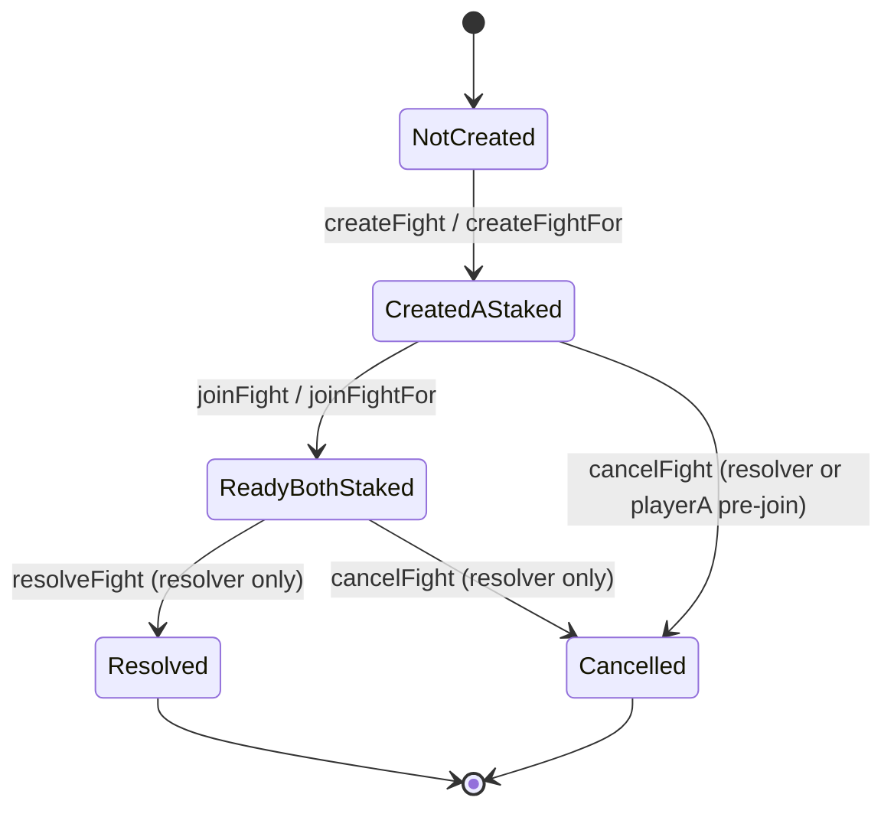

# FaightersEscrow Contract Reference

This document is the deep API and behavior reference for [`FaightersEscrow.sol`](/Users/santisiri/AI/faighters/src/FaightersEscrow.sol).

It is intended for:

- Smart contract engineers
- Backend/resolver operators
- Frontend integrators (wagmi/viem/ethers)
- Auditors and autonomous coding agents

## 1) Contract Purpose and Runtime Model

`FaightersEscrow` is a two-player token escrow with resolver-driven settlement.

Runtime roles:

- `playerA`: creates and stakes first.
- `playerB`: joins and stakes matching amount.
- `resolver`: trusted backend signer that resolves outcomes and can cancel unresolved fights.
- `owner`: admin controls (`setResolver`, `pause`, `unpause`, `emergencyWithdraw`).

Core settlement model:

- Total pot = `stakeAmount * 2`
- Winner payout = `70%`
- House cut = `30%`
- House cut is burned in SAIRI:
  - If stake token is SAIRI: burn directly.
  - Else: swap house-cut token -> SAIRI using Uniswap V3 `exactInputSingle`, then burn SAIRI output.

## 2) Fixed Constants and Addresses

The contract hardcodes these Base mainnet addresses:

- `WETH`: `0x4200000000000000000000000000000000000006`
- `USDC`: `0x833589fCD6eDb6E08f4c7C32D4f71b54bdA02913`
- `USDT`: `0xfde4C96c8593536E31F229EA8f37b2ADa2699bb2`
- `SAIRI`: `0xde61878b0b21ce395266c44D4d548D1C72A3eB07`
- `SWAP_ROUTER`: `0x2626664c2603336E57B271c5C0b26F421741e481`
- `BURN_ADDRESS`: `0x000000000000000000000000000000000000dEaD`

Other constants:

- `UNISWAP_POOL_FEE = 3000` (0.3%)
- `WINNER_PCT = 70`
- `HOUSE_PCT = 30`

## 3) Storage Layout

### 3.1 Global storage

- `address public resolver`
- `mapping(address => uint256) public reservedTokenBalance`
- `mapping(bytes32 => Fight) public fights`

### 3.2 Fight struct

```solidity
struct Fight {
    bytes32 fightId;
    address tokenUsed;
    uint256 stakeAmount;
    uint256 joinDeadline;
    uint256 resolveDeadline;
    address playerA;
    address playerB;
    bool playerAStaked;
    bool playerBStaked;
    bool resolved;
    address winner;
}
```

Field semantics:

- `fightId`: unique external identifier, should map to off-chain session id.
- `tokenUsed`: one of WETH/USDC/USDT/SAIRI only.
- `stakeAmount`: per-player stake in token raw units.
- `joinDeadline`: latest allowed timestamp for joining (`0` disables deadline).
- `resolveDeadline`: latest allowed timestamp for resolving (`0` disables deadline).
- `playerA` / `playerB`: participants.
- `playerAStaked` / `playerBStaked`: deposit flags.
- `resolved`: terminal flag (true after resolve or cancel).
- `winner`: address of winner on resolve; `address(0)` on cancel or unresolved.

## 4) State Machine



Important terminal behavior:

- Both resolved and cancelled fights set `resolved = true`.
- Cancelled fights set `winner = address(0)`.
- Attempts to resolve or cancel again revert with `FightResolvedAlready`.

## 5) Accounting Model (Critical)

`reservedTokenBalance[token]` tracks unresolved obligations for each token.

- On first stake: `+ stakeAmount`
- On second stake: `+ stakeAmount`
- On resolve: `- totalPot`
- On cancel: `- (sum of posted stakes)`

This supports surplus-safe owner withdrawals:

- Withdrawable surplus = `contractBalance - reserved`
- `emergencyWithdraw(token)` can only move surplus.

Invariant target:

- For each supported token: `IERC20(token).balanceOf(address(this)) >= reservedTokenBalance[token]`

## 6) Access Control Matrix

- `setResolver`: owner only
- `pause`, `unpause`: owner only
- `createFight`: any caller (as playerA)
- `createFightWithDeadlines`: any caller (as playerA)
- `createFightFor*`: resolver only
- `joinFight`: any caller (as playerB)
- `joinFightFor`: resolver only
- `resolveFight*`: resolver only
- `cancelFight`: resolver always, or playerA only before playerB joins
- `emergencyWithdraw`: owner only
- `getFight`, `getWithdrawableSurplus`: read-only, public

Pause behavior:

- `create*`, `join*`, `resolve*`, and `cancelFight` are blocked while paused.
- Admin calls (`setResolver`, `pause`, `unpause`, `emergencyWithdraw`) are not pause-gated.

## 7) Function-by-Function Reference

### 7.1 Constructor

#### `constructor(address resolver_, address owner_)`

Purpose:

- Set initial resolver and owner.

Checks:

- `resolver_ != address(0)` else `ZeroAddress`.
- `WINNER_PCT + HOUSE_PCT == 100` else `InvalidPercentConfig`.

Effects:

- Stores resolver.
- Sets owner via `Ownable(owner_)`.

### 7.2 Admin functions

#### `setResolver(address newResolver)`

Access:

- `onlyOwner`

Checks:

- `newResolver != address(0)` else `ZeroAddress`.

Effects:

- Updates `resolver`.
- Emits `ResolverUpdated(previousResolver, newResolver)`.

#### `pause()`

Access:

- `onlyOwner`

Effects:

- Sets paused state true.

#### `unpause()`

Access:

- `onlyOwner`

Effects:

- Sets paused state false.

### 7.3 Create functions

#### `createFight(bytes32 fightId, address token, uint256 stakeAmount)`

Caller semantics:

- Caller becomes `playerA`.

Flow:

- Delegates to `_createFight(..., msg.sender, 0, 0)`.

#### `createFightWithDeadlines(bytes32 fightId, address token, uint256 stakeAmount, uint256 joinDeadline, uint256 resolveDeadline)`

Caller semantics:

- Caller becomes `playerA`.

Flow:

- Delegates to `_createFight(..., msg.sender, joinDeadline, resolveDeadline)`.

#### `createFightFor(bytes32 fightId, address token, uint256 stakeAmount, address playerA)`

Access:

- `onlyResolver`

Caller semantics:

- Resolver submits tx, but stake is pulled from `playerA`.

Flow:

- Validates `playerA != address(0)`.
- Delegates to `_createFight(..., playerA, 0, 0)`.

#### `createFightForWithDeadlines(bytes32 fightId, address token, uint256 stakeAmount, address playerA, uint256 joinDeadline, uint256 resolveDeadline)`

Access:

- `onlyResolver`

Flow:

- Validates `playerA != address(0)`.
- Delegates to `_createFight(..., playerA, joinDeadline, resolveDeadline)`.

#### Internal `_createFight(...)` behavior

Checks:

- `fightId != bytes32(0)` else `InvalidFightId`.
- `token` is in allowlist else `UnsupportedToken(token)`.
- `stakeAmount > 0` else `InvalidStakeAmount`.
- fight does not already exist (`fight.playerA == address(0)`) else `FightAlreadyExists(fightId)`.
- deadline window valid via `_validateDeadlines`.

Token movement:

- `safeTransferFrom(playerA, address(this), stakeAmount)`.

State updates:

- `reservedTokenBalance[token] += stakeAmount`.
- Creates fight with:
  - `playerAStaked = true`
  - `playerBStaked = false`
  - `resolved = false`
  - `winner = address(0)`

Event:

- `FightCreated(fightId, playerA, token, stakeAmount)`.

### 7.4 Join functions

#### `joinFight(bytes32 fightId)`

Caller semantics:

- Caller becomes `playerB`.

Flow:

- Delegates to `_joinFight(fightId, msg.sender)`.

#### `joinFightFor(bytes32 fightId, address playerB)`

Access:

- `onlyResolver`

Flow:

- Validates `playerB != address(0)`.
- Delegates to `_joinFight(fightId, playerB)`.

#### Internal `_joinFight(...)` behavior

Checks:

- Fight exists else `FightNotFound(fightId)`.
- Not already resolved else `FightResolvedAlready(fightId)`.
- Not already joined else `AlreadyJoined(fightId)`.
- `playerB != playerA` else `CannotJoinOwnFight`.
- If `joinDeadline != 0`, requires `block.timestamp <= joinDeadline`; otherwise `JoinDeadlinePassed(fightId, joinDeadline)`.

Token movement:

- `safeTransferFrom(playerB, address(this), fight.stakeAmount)`.

State updates:

- `reservedTokenBalance[token] += fight.stakeAmount`.
- sets `fight.playerB` and `fight.playerBStaked = true`.

Event:

- `FightJoined(fightId, playerB)`.

### 7.5 Resolve functions

#### `resolveFight(bytes32 fightId, address winnerAddress)`

Access:

- `onlyResolver`

Usage:

- Intended for SAIRI fights.
- For non-SAIRI fights, this path reverts (`MinSairiOutRequired`) because `minSairiOut` resolves to 0.

Flow:

- Delegates to `_resolveFight(fightId, winnerAddress, 0)`.

#### `resolveFight(bytes32 fightId, address winnerAddress, uint256 minSairiOut)`

Access:

- `onlyResolver`

Usage:

- Required for non-SAIRI fights.

Flow:

- Delegates to `_resolveFight(fightId, winnerAddress, minSairiOut)`.

#### Internal `_resolveFight(...)` behavior

Checks:

- Fight exists else `FightNotFound(fightId)`.
- Not resolved else `FightResolvedAlready(fightId)`.
- Both stakes posted else `FightNotReady(fightId)`.
- Winner must be `playerA` or `playerB`; else `InvalidWinner(winnerAddress)`.
- If `resolveDeadline != 0`, requires `block.timestamp <= resolveDeadline`; else `ResolveDeadlinePassed(fightId, resolveDeadline)`.

Settlement math:

- `totalPot = stakeAmount * 2`
- `winnerPayout = totalPot * 70 / 100`
- `houseCut = totalPot - winnerPayout`

Pre-transfer state update:

- `reservedTokenBalance[token] -= totalPot`
- `fight.resolved = true`
- `fight.winner = winnerAddress`

Winner payout:

- `token.safeTransfer(winnerAddress, winnerPayout)`

House cut handling:

1. SAIRI fights:
   - `sairiBurned = houseCut`
   - `token.safeTransfer(BURN_ADDRESS, houseCut)`

2. Non-SAIRI fights:
   - requires `minSairiOut != 0`, else `MinSairiOutRequired`
   - `token.forceApprove(SWAP_ROUTER, houseCut)`
   - calls `exactInputSingle` with:
     - `tokenIn = fight.tokenUsed`
     - `tokenOut = SAIRI`
     - `fee = UNISWAP_POOL_FEE`
     - `recipient = address(this)`
     - `deadline = block.timestamp`
     - `amountIn = houseCut`
     - `amountOutMinimum = minSairiOut`
     - `sqrtPriceLimitX96 = 0`
   - receives `sairiBurned`
   - burns received SAIRI via transfer to dead address

Event:

- `FightResolved(fightId, winner, tokenUsed, winnerPayout, houseCutInput, sairiBurned)`

Atomicity note:

- If swap fails or slippage is insufficient, whole transaction reverts.
- All prior state writes and winner payout revert too.

### 7.6 Cancel function

#### `cancelFight(bytes32 fightId)`

Access:

- `resolver` anytime pre-resolution
- `playerA` only before playerB joins

Checks:

- Fight exists else `FightNotFound(fightId)`.
- Not resolved else `FightResolvedAlready(fightId)`.
- Caller must match allowed cancel paths else `Unauthorized`.

Refund calculation:

- Refunds `stakeAmount` to each side that had staked.

State updates:

- `reservedTokenBalance[token] -= refundAmount`
- marks `resolved = true`
- sets `winner = address(0)`

Token movement:

- Refunds playerA and/or playerB.

Event:

- `FightCancelled(fightId, cancelledBy)`

### 7.7 View functions

#### `getFight(bytes32 fightId) returns (Fight memory)`

Returns full struct snapshot from storage mapping.

#### `getWithdrawableSurplus(address token) returns (uint256)`

Formula:

- `max(IERC20(token).balanceOf(address(this)) - reservedTokenBalance[token], 0)`

### 7.8 Emergency withdrawal

#### `emergencyWithdraw(address token)`

Access:

- `onlyOwner`

Checks:

- `amount = getWithdrawableSurplus(token)`
- if `amount < 1`, reverts `NoSurplusAvailable(token)`

Effects:

- Transfers `amount` to owner.
- Emits `EmergencyWithdraw(token, owner, amount)`.

Safety:

- Cannot withdraw unresolved-fight liabilities.

## 8) Deadline Semantics

Creation validation (`_validateDeadlines`):

- If join deadline set, it must be strictly in future (`> now`).
- If resolve deadline set, it must be strictly in future (`> now`).
- If both set, `resolveDeadline` must be strictly greater than `joinDeadline`.

Execution checks:

- Join is allowed while `block.timestamp <= joinDeadline`.
- Resolve is allowed while `block.timestamp <= resolveDeadline`.

Meaning:

- Exact deadline timestamp is still valid.
- First invalid block is strictly after deadline.

## 9) Events

- `ResolverUpdated(previousResolver, newResolver)`
- `FightCreated(fightId, playerA, token, stakeAmount)`
- `FightJoined(fightId, playerB)`
- `FightResolved(fightId, winner, tokenUsed, winnerPayout, houseCutInput, sairiBurned)`
- `FightCancelled(fightId, cancelledBy)`
- `EmergencyWithdraw(token, to, amount)`

Operational guidance:

- Index by `fightId` and event type for reconciliation.
- Keep tx hash + block number + off-chain decision id linked in backend logs.

## 10) Custom Errors (Revert Catalog)

- `UnsupportedToken(address token)`
- `InvalidStakeAmount()`
- `InvalidFightId()`
- `FightAlreadyExists(bytes32 fightId)`
- `FightNotFound(bytes32 fightId)`
- `AlreadyJoined(bytes32 fightId)`
- `CannotJoinOwnFight()`
- `FightNotReady(bytes32 fightId)`
- `FightResolvedAlready(bytes32 fightId)`
- `InvalidWinner(address winner)`
- `ResolverOnly()`
- `Unauthorized()`
- `ZeroAddress()`
- `MinSairiOutRequired()`
- `InvalidPercentConfig()`
- `NoSurplusAvailable(address token)`
- `InvalidDeadlineWindow()`
- `JoinDeadlinePassed(bytes32 fightId, uint256 joinDeadline)`
- `ResolveDeadlinePassed(bytes32 fightId, uint256 resolveDeadline)`

## 11) Integration Guidance

### 11.1 Choosing the right create/join method

- Use `createFight`/`joinFight` when users send tx directly.
- Use `createFightFor`/`joinFightFor` when backend resolver wallet submits tx on users' behalf (users must pre-approve token allowance).

### 11.2 Choosing the right resolve method

- If `tokenUsed == SAIRI`, either resolve overload can work.
- If `tokenUsed != SAIRI`, use `resolveFight(fightId, winner, minSairiOut)` with non-zero `minSairiOut`.

### 11.3 Recommended resolver preflight

Before resolve:

1. `getFight(fightId)`
2. Check `resolved == false`
3. Check both stakes are present
4. Check winner is one of players
5. Check deadline has not passed
6. For non-SAIRI, compute quote and apply slippage tolerance

## 12) Operational and Security Notes

- Keep `owner` and `resolver` keys separate.
- Prefer multisig for owner.
- Use pause during incident response.
- Resolver key rotation procedure:
  - owner calls `setResolver(newResolver)`
  - backend switches signer
  - old key retired

Known routing caveat from current fork tests:

- Contract uses fixed fee tier `3000`.
- Fork tests currently show USDC/SAIRI `0.3%` pool may be absent while `1%` exists.
- Non-SAIRI resolution can revert if configured pool does not exist or has unusable liquidity.

## 13) Example `cast` Commands

Assume:

- `ESCROW_ADDRESS`
- `BASE_RPC_URL`
- `RESOLVER_PRIVATE_KEY`
- `OWNER_PRIVATE_KEY`

### Read resolver and paused status

```bash
cast call "$ESCROW_ADDRESS" "resolver()(address)" --rpc-url "$BASE_RPC_URL"
cast call "$ESCROW_ADDRESS" "paused()(bool)" --rpc-url "$BASE_RPC_URL"
```

### Read full fight

```bash
cast call "$ESCROW_ADDRESS" \
  "getFight(bytes32)(bytes32,address,uint256,uint256,uint256,address,address,bool,bool,bool,address)" \
  "$FIGHT_ID" \
  --rpc-url "$BASE_RPC_URL"
```

### Resolve SAIRI fight

```bash
cast send "$ESCROW_ADDRESS" \
  "resolveFight(bytes32,address)" \
  "$FIGHT_ID" "$WINNER" \
  --private-key "$RESOLVER_PRIVATE_KEY" \
  --rpc-url "$BASE_RPC_URL"
```

### Resolve non-SAIRI fight

```bash
cast send "$ESCROW_ADDRESS" \
  "resolveFight(bytes32,address,uint256)" \
  "$FIGHT_ID" "$WINNER" "$MIN_SAIRI_OUT" \
  --private-key "$RESOLVER_PRIVATE_KEY" \
  --rpc-url "$BASE_RPC_URL"
```

### Pause and unpause

```bash
cast send "$ESCROW_ADDRESS" "pause()" \
  --private-key "$OWNER_PRIVATE_KEY" --rpc-url "$BASE_RPC_URL"

cast send "$ESCROW_ADDRESS" "unpause()" \
  --private-key "$OWNER_PRIVATE_KEY" --rpc-url "$BASE_RPC_URL"
```

## 14) Source of Truth

For exact behavior, always verify against:

- Contract source: [`src/FaightersEscrow.sol`](/Users/santisiri/AI/faighters/src/FaightersEscrow.sol)
- Main test suite: [`test/FaightersEscrow.t.sol`](/Users/santisiri/AI/faighters/test/FaightersEscrow.t.sol)
- Fork tests: [`test/fork/FaightersEscrowBaseFork.t.sol`](/Users/santisiri/AI/faighters/test/fork/FaightersEscrowBaseFork.t.sol)
- Invariants: [`test/invariant/FaightersEscrowInvariant.t.sol`](/Users/santisiri/AI/faighters/test/invariant/FaightersEscrowInvariant.t.sol)
